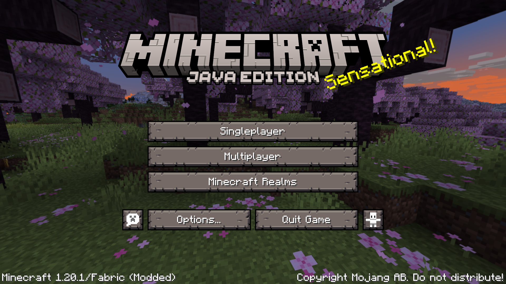
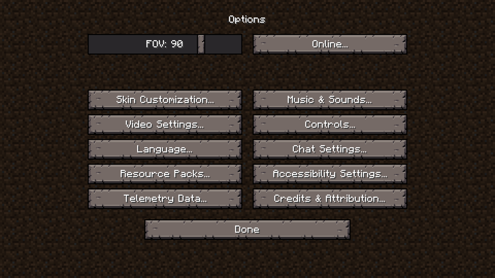

# About

**Pocketed** is a Resource Pack that redesigns Minecraft's GUI elements to look more like alpha Pocket Edition's GUIs. 

> This Resource Pack is still in active development and most GUIs are still unfinished.

# Gallery

# License

This project is licensed under [CC BY-SA 4.0](https://creativecommons.org/licenses/by-sa/4.0/).

You are free to include this project in your modpacks.
